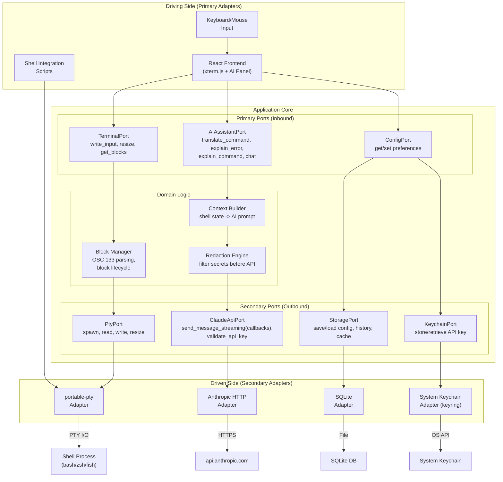

# AI Terminal - Architecture Design

**Status:** Approved
**Date:** 2026-03-19 (reviewed 2026-03-22)
**Style:** Hexagonal (Ports & Adapters)
**Deployment:** Monolithic Tauri v2 Desktop Application

---

## 1. System Overview

AI Terminal is a desktop terminal emulator with integrated Claude AI assistance. It uses the user's own Anthropic API key -- no intermediary server. The system combines a web-based terminal frontend (xterm.js) with a Rust backend (Tauri v2) that manages PTY sessions, Claude API calls, and local persistence.

### Design Philosophy

- **MVP first.** Ship a working terminal with basic AI features. Evolve from there.
- **Hexagonal architecture.** Business logic depends on ports (traits/interfaces), not concrete implementations. Adapters are swappable.
- **Monolithic.** Single Tauri binary. No microservices, no separate backend process.
- **User owns the AI relationship.** Direct API calls to Anthropic using the user's key. No telemetry, no proxy.

---

## 2. Hexagonal Architecture



---

## 3. Component Descriptions

### 3.1 Frontend (React + TypeScript)

| Component | Responsibility |
|-----------|---------------|
| Terminal View | xterm.js instance with WebGL renderer. Renders terminal output, handles user keyboard input. |
| Block Manager | Parses OSC 133 sequences from terminal output. Groups input/output into discrete blocks. Renders block boundaries and metadata (exit code, duration). |
| AI Panel | Sidebar for chat-style AI interaction. Displays streaming responses. Shows command suggestions with confirmation UI. |
| Inline Suggestion | Ghost text overlay on the terminal for AI-suggested completions. Accept with Tab. |
| Settings View | Configuration UI for API key entry, model selection, theme, and preferences. |

### 3.2 Backend (Rust / Tauri)

| Component | Responsibility |
|-----------|---------------|
| PTY Manager | Spawns shell processes via portable-pty. Forwards I/O between frontend and shell. Handles resize signals. |
| Claude API Client | Makes streaming HTTP requests to the Anthropic Messages API. Manages tool-use responses. Routes to appropriate model (Haiku for fast tasks, Sonnet for complex). |
| Context Builder | Assembles AI prompts from shell state: working directory, recent commands, error output, shell type, OS info. |
| Redaction Engine | Applies regex patterns to strip secrets, API keys, passwords, PII, and private keys from content before it reaches the Claude API. |
| Config Manager | Reads/writes application configuration. Manages user preferences, keybindings, and theme settings. |
| Keychain Manager | Stores and retrieves the Anthropic API key using the OS keychain. Falls back to ANTHROPIC_API_KEY env var. |
| Storage Manager | SQLite operations for command history, AI response cache, and configuration persistence. |

### 3.3 Shell Integration Scripts

Lightweight scripts sourced into bash/zsh/fish that emit OSC 133 sequences at prompt boundaries. These enable block detection and exit code tracking. Distributed with the application binary and injected automatically at shell spawn.

---

## 4. Communication Patterns

### 4.1 Synchronous (Tauri Commands)

Used for request-response interactions where the frontend needs a result before proceeding.

- **Config read/write**: `get_config`, `set_config`
- **API key management**: `store_api_key`, `has_api_key`
- **PTY spawn**: `create_terminal_session`
- **PTY write**: `write_to_pty` (user keystrokes forwarded to shell)
- **PTY resize**: `resize_pty`

### 4.2 Asynchronous (Tauri Events)

Used for streaming data and push notifications from backend to frontend.

| Event | Direction | Payload |
|-------|-----------|---------|
| `pty:data` | Backend -> Frontend | Raw terminal output bytes |
| `pty:exit` | Backend -> Frontend | Shell process exit code |
| `pty:error` | Backend -> Frontend | PTY failure details (error_type + message) |
| `ai:stream-chunk` | Backend -> Frontend | Incremental AI response text |
| `ai:stream-end` | Backend -> Frontend | Final response metadata (tokens used, model) |
| `ai:error` | Backend -> Frontend | API error details |

### 4.3 Data Flow: User Types a Command

```
User Keystroke
  -> React captures key event
  -> Tauri invoke: write_to_pty(session_id, bytes)
  -> PTY Manager writes to PTY master fd
  -> Shell processes input
  -> Shell writes output to PTY slave
  -> PTY Manager reads from PTY master fd
  -> Tauri event: pty:data(bytes)
  -> xterm.js writes bytes to terminal buffer
  -> Block Manager scans for OSC 133 sequences
  -> UI renders updated terminal + block boundaries
```

### 4.4 Data Flow: AI Command Translation

```
User activates AI input (hotkey)
  -> Types natural language query
  -> React sends Tauri invoke: ai_translate_command(query, context)
  -> TauriCommandAdapter (primary adapter) creates StreamingCallbacks
     that emit Tauri events on each callback invocation
  -> Context Builder gathers shell state (cwd, shell type, recent commands)
  -> Redaction Engine filters sensitive data from context
  -> ClaudeApiPort.send_message_streaming(prompt, callbacks)
  -> AnthropicHttpAdapter reads SSE stream from api.anthropic.com
  -> For each SSE chunk: adapter calls callbacks.on_chunk(text)
  -> StreamingCallbacks impl emits ai:stream-chunk Tauri event
  -> Frontend renders streaming response in AI panel
  -> On stream end: adapter calls callbacks.on_completion(metadata)
  -> StreamingCallbacks impl emits ai:stream-end Tauri event
  -> User confirms -> write_to_pty sends command to shell
```

Note: The secondary adapter (AnthropicHttpAdapter) never emits Tauri events directly. It invokes the StreamingCallbacks trait, keeping infrastructure concerns in the primary adapter layer.

### 4.5 Data Flow: Error Diagnosis

```
Block Manager detects non-zero exit code (OSC 133 ;D;N where N != 0)
  -> UI shows "Diagnose with AI" affordance on the failed block
  -> User clicks diagnose
  -> React sends Tauri invoke: ai_explain_error(command, output, exit_code, context)
  -> Context Builder + Redaction Engine prepare sanitized context
  -> Claude API Client streams explanation
  -> Frontend renders diagnosis below the failed block
```

### 4.6 Data Flow: PTY Failure Recovery

```
PTY read loop encounters I/O error or EOF with crash signal
  -> Tokio task catches error
  -> Attempts to kill child process (if still alive)
  -> Finalizes any incomplete blocks with error state
  -> Flushes command history to SQLite
  -> Cancels pending AI requests for this session
  -> Emits pty:error(session_id, error_type, message)
  -> Drops PTY file descriptors and Tokio task resources
  -> Frontend receives pty:error event
  -> ErrorBanner rendered in terminal tab: "Session failed: {message}"
  -> User can "Close" (remove tab) or "Reopen" (new session in same tab)
```

---

## 5. Key Design Decisions

### 5.1 Why Tauri v2 Over Electron

Electron bundles Chromium (~150MB). Tauri uses the OS webview (~10MB binary). For a terminal app where binary size and memory matter, this is significant. Tauri's Rust backend also gives us native-speed PTY management and HTTP client without Node.js overhead.

### 5.2 Why xterm.js Over Custom Rendering

xterm.js is battle-tested (VS Code, Tabby, Hyper) and handles the full complexity of VT100/ANSI parsing, Unicode, IME input, accessibility, and screen reader support. Building a custom terminal renderer is a multi-year effort. The WebGL renderer addon provides adequate performance for our use case.

EVOLUTION: If rendering performance becomes a bottleneck, the hexagonal boundary between the frontend and backend allows migrating to a native GPU renderer without changing backend logic.

### 5.3 Why Claude API Calls from Rust Backend, Not Frontend

- The API key must not be exposed to the webview JavaScript context.
- The redaction engine runs in Rust before data leaves the process.
- Rust's reqwest/hyper provides robust streaming HTTP with proper error handling.
- The backend can enforce rate limiting and cost controls.

### 5.4 Why SQLite, Not a More Complex Store

Single-file database. Zero configuration. Embedded in the binary via rusqlite. Handles all our persistence needs (config, history, cache) without external dependencies. The data volume is small (terminal history + cached AI responses).

### 5.5 Why OSC 133 for Block Detection

OSC 133 is the established standard supported by Ghostty, Kitty, WezTerm, VS Code, and iTerm2. Using the standard protocol means our shell integration scripts are compatible with other terminals, and users familiar with these tools will find familiar behavior.

EVOLUTION: Richer block metadata (git branch, timing breakdown) can be added via custom OSC sequences without breaking OSC 133 compatibility.

### 5.6 Why System Keychain for API Key Storage

The API key is the user's direct access to a paid service. Storing it in a plain-text config file is unacceptable. The keyring crate provides cross-platform access to macOS Keychain, Windows Credential Manager, and Linux Secret Service (via D-Bus). Environment variable fallback (`ANTHROPIC_API_KEY`) is supported for CI/advanced users.

---

## 6. Security Architecture

### 6.1 Threat Boundary

```
+-----------------------------+          +-------------------+
|  User's Machine (Trusted)   |          | External (Untrust)|
|                             |          |                   |
|  Tauri App                  |   TLS    |  api.anthropic.com|
|    PTY <-> Shell            | -------> |                   |
|    Redaction Engine         |          +-------------------+
|    SQLite DB                |
|    System Keychain          |
+-----------------------------+
```

All processing happens locally. The only external communication is HTTPS to `api.anthropic.com`.

### 6.2 Redaction Rules (MVP)

Applied to all content before it is sent to the Claude API:

- API keys and tokens (`API_KEY=...`, `Bearer ...`)
- AWS credentials (`AWS_ACCESS_KEY_ID`, `AWS_SECRET_ACCESS_KEY`)
- Private keys (PEM blocks)
- Connection strings (postgres://, mongodb://, redis://, mysql://)
- Email addresses
- User-defined custom patterns

EVOLUTION: ML-based secret detection, configurable sensitivity levels, audit log of what was redacted.

### 6.3 API Key Lifecycle

1. First run: Settings UI prompts for API key.
2. Validation: Test call to Anthropic API.
3. Storage: System keychain via keyring crate.
4. Runtime: Retrieved from keychain on app launch, held in memory.
5. Never logged, never written to SQLite, never exposed to webview.

---

## 7. Deployment Architecture

Single binary produced by `tauri build`. Contains:

- Compiled Rust backend (PTY manager, API client, SQLite, etc.)
- Bundled web assets (React app, xterm.js, CSS)
- Shell integration scripts (embedded as resources)
- SQLite database created at first run in OS-appropriate app data directory

Target platforms (MVP): macOS. EVOLUTION: Linux, Windows.

---

## 8. Quality Attribute Strategies

| Attribute | Strategy |
|-----------|----------|
| **Performance** | xterm.js WebGL renderer. Async PTY I/O on dedicated thread. Streaming AI responses. Debounced completion requests (300-500ms). |
| **Security** | Redaction engine on all AI-bound content. API key in system keychain. No intermediary servers. HTTPS only. |
| **Reliability** | Graceful degradation when API is unavailable (terminal works without AI). PTY error recovery with explicit failure modes (spawn_failure, read_io_error, process_crash) and user-facing error banners. SQLite WAL mode for crash safety. |
| **Maintainability** | Hexagonal architecture. Clear port/adapter boundaries. Domain logic testable without infrastructure. |
| **Usability** | Familiar terminal behavior (xterm.js compatibility). Progressive AI disclosure (terminal works standalone, AI is additive). |

EVOLUTION: Performance monitoring, telemetry (opt-in), automated crash reporting.
