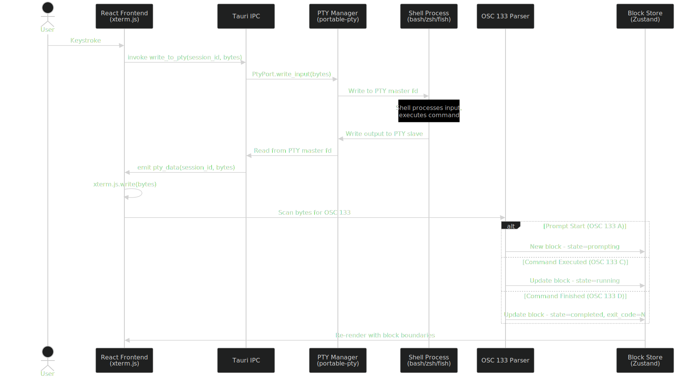
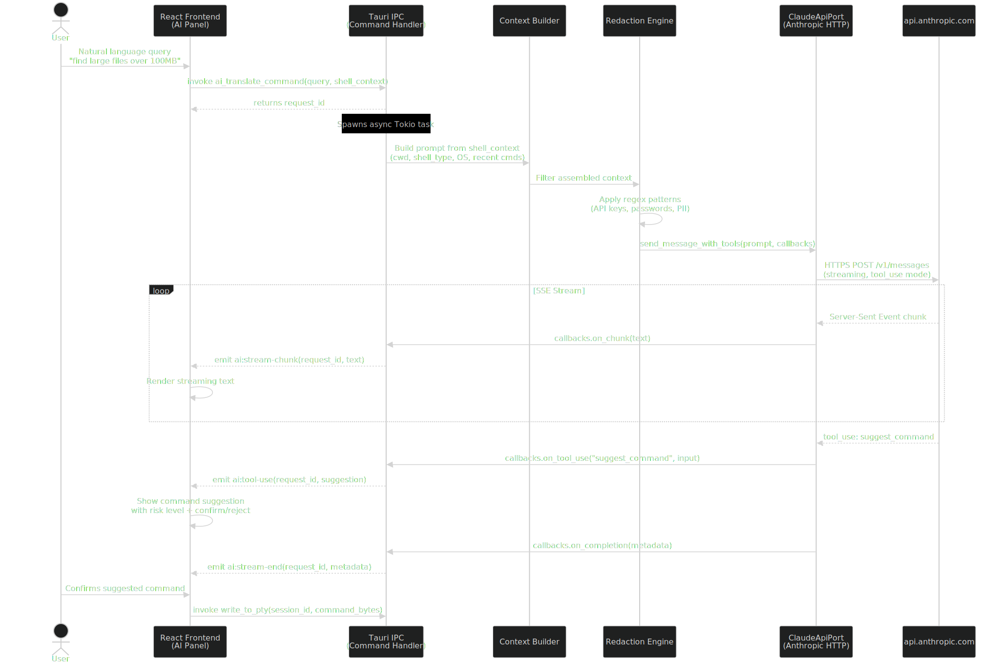

<!-- _class: lead -->
<!-- _paginate: false -->

# Cortex: AI Terminal

## Quick Overview

Warp-inspired terminal with Claude AI -- built with Tauri v2, xterm.js, portable-pty

---

# What Is Cortex?

A desktop terminal emulator with integrated Claude AI assistance.

**What makes it different:**
- AI-powered command translation, error diagnosis, and completions
- Uses the developer's own Anthropic API key -- no intermediary servers
- Warp-style "blocks" for structured command output
- Terminal works perfectly without AI (AI is additive)

**Status:** Architecture and design phase. No source code yet.

**Stack:** Tauri v2 (Rust backend) + React/TypeScript frontend + xterm.js + portable-pty

---

# System Context

All processing is local. Only HTTPS calls to `api.anthropic.com` cross the trust boundary.

---

# Technology Stack

---

# Why This Stack?

| Factor | Tauri + xterm.js | Full Rust + GPU | Electron |
|--------|-----------------|-----------------|----------|
| Dev Speed | Excellent | Poor | Excellent |
| Performance | Good | Excellent | Fair |
| Binary Size | ~10 MB | ~5 MB | ~150 MB |

**Verdict:** AI is the differentiator, not rendering speed. Tauri maximizes development velocity.

**Migration path:** Hexagonal architecture allows swapping xterm.js for native GPU renderer later.

---

# Hexagonal Architecture

---

# Architecture in One Sentence

The domain core (Block Manager, Context Builder, Redaction Engine) depends on port traits, not concrete implementations -- so adapters for PTY, Claude API, SQLite, and Keychain are swappable, and domain logic is testable without infrastructure.

**Three primary ports:** TerminalPort, AIAssistantPort, ConfigPort

**Four secondary ports:** PtyPort, ClaudeApiPort, StoragePort, KeychainPort

**Critical rule:** `domain/` never imports from `adapters/`

---

# Data Flow: Command Execution

---

# Data Flow: AI Translation

---

# Security

Terminal context contains secrets. Cortex defends with layered security:

1. **Redaction Engine** -- Regex patterns strip API keys, passwords, PII before API calls
2. **System Keychain** -- API key never in config files or SQLite
3. **No proxy servers** -- Direct HTTPS to api.anthropic.com
4. **Opt-in context** -- User controls what is sent to AI

---

# Key Design Decisions

| Decision | Rationale |
|----------|-----------|
| Tauri v2 over Electron | 15x smaller binary, Rust backend |
| xterm.js over custom renderer | Battle-tested, full VT100, years of dev saved |
| Claude API from Rust | API key security, redaction before transmission |
| OSC 133 for blocks | Industry standard (Ghostty, Kitty, VS Code) |
| SQLite for persistence | Zero-config, embedded, crash-safe (WAL) |
| System keychain for API key | OS-native credential security |

All decisions documented with alternatives and rejection rationale.

---

# Implementation Roadmap

| Phase | Weeks | Deliverable |
|-------|-------|-------------|
| **1. Core Terminal** | 1-4 | Tauri + xterm.js + PTY working |
| **2. Shell Integration** | 5-8 | OSC 133 blocks, shell scripts |
| **3. Claude AI** | 9-12 | NL commands, error diagnosis, chat |
| **4. Polish** | 13-16 | Completions, caching, themes |

**16 weeks** from empty project to feature-complete v1.0.

---

# Risks

| Risk | Mitigation |
|------|------------|
| xterm.js WebGL performance | Benchmark Phase 1; hexagonal boundary allows swap |
| No Anthropic Rust SDK | reqwest + manual SSE; monitor for official release |
| API rate limits | Debouncing, local caching, graceful degradation |
| Session memory growth | Scrollback limits, block GC, configurable retention |

---

<!-- _class: lead -->
<!-- _paginate: false -->

# End of Overview

**Next step:** Phase 1 implementation -- Core Terminal

For the full walkthrough (30 slides), see `cortex-walkthrough.md`
