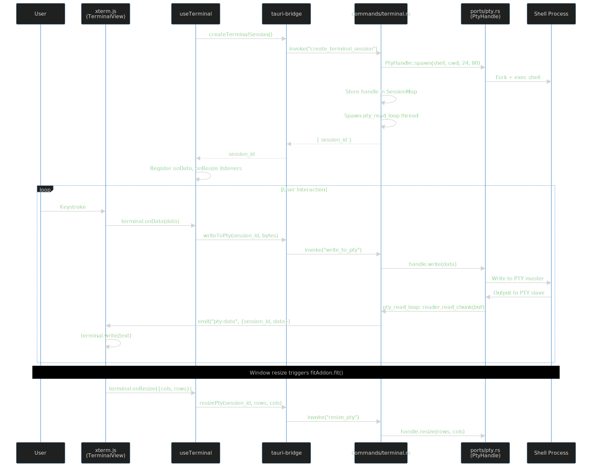
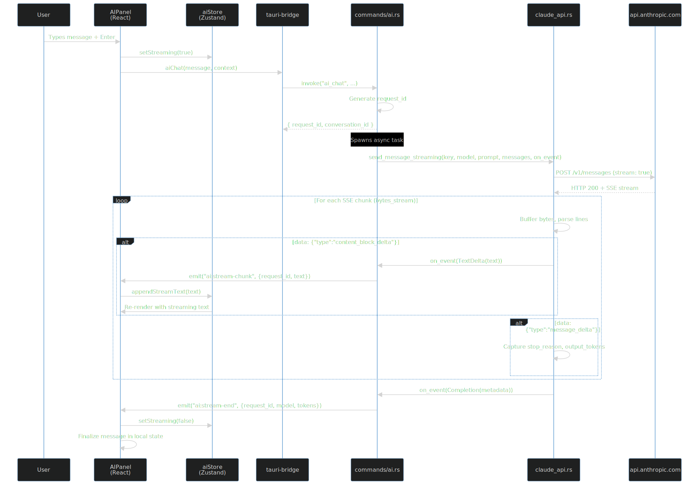

# AI Terminal (Cortex)

## System Walkthrough -- v3 Final

An AI-driven terminal emulator with Claude integration,
built with **Tauri v2** (Rust) + **React** + **xterm.js**

*All implementation phases complete*

<!-- _class: lead -->
<!-- Tier: 1 | Type: Explanation | Audience: All -->

---

# Agenda

1. **Setting** -- What problem does this solve, and for whom?
2. **System Context** -- Where does it sit in the world?
3. **Architecture** -- How is the Rust backend organized?
4. **Frontend** -- React component hierarchy and state
5. **Data Flows** -- PTY I/O and SSE streaming (deep-dive)
6. **Key Decisions** -- Why these choices?
7. **Implementation Status** -- What shipped, what is deferred
8. **Getting Started** -- How to run it

<!-- Tier: 1 | Type: Reference | Audience: All -->

---

# The Terminal AI Gap

Developers live in terminals. AI assistants live in chat windows.

**The gap:** switching context between terminal and AI wastes time.

Existing solutions either:
- Require a subscription to a proprietary service (Warp, Cursor)
- Send your terminal data through third-party servers
- Bolt AI onto terminals as an afterthought

**Cortex's thesis:** bring AI *into* the terminal, using your own API key, with no intermediary.

**Target user:** a developer who uses a terminal daily, has an Anthropic API key,
and cares about data privacy (no telemetry, no proxy servers).

<!-- Tier: 1 | Type: Explanation | Audience: All -->

---

# System Context



The system has exactly **one external network dependency**: HTTPS to `api.anthropic.com`.
Everything else is local.

<!-- Tier: 1 | Type: Explanation | Audience: All -->

---

# Technology Stack

| Layer | Technology | Role |
|-------|-----------|------|
| Framework | **Tauri v2** | Desktop app shell, IPC, binary packaging |
| Backend | **Rust** (1.77+) | PTY management, API calls, persistence |
| Frontend | **React 18** + TypeScript | UI components, state management |
| Terminal | **xterm.js** + WebGL | Terminal emulation and rendering |
| PTY | **portable-pty** 0.8 | Cross-platform pseudo-terminal |
| AI | **reqwest** + SSE parsing | Claude API streaming client |
| Database | **rusqlite** (SQLite) | Config, history, cache |
| State | **Zustand** | Frontend state management (~2KB) |

<!-- Tier: 1 | Type: Reference | Audience: All -->

---

# Hexagonal Architecture (As Implemented)



<!-- Tier: 1 | Type: Explanation | Audience: All -->

---

# Backend Module Map

**13 Rust source files, 1,131 total lines**

```
src-tauri/src/
  main.rs              (6 lines)    Entry point
  lib.rs               (58 lines)   Bootstrap, state init, command registration

  commands/            -- Primary adapters (Tauri IPC handlers)
    terminal.rs        (140 lines)  PTY session lifecycle
    ai.rs              (301 lines)  AI operations (translate, error, chat)
    config.rs          (67 lines)   Settings + API key management

  domain/              -- Business logic
    redaction.rs       (77 lines)   6 regex patterns, 4 unit tests
    context.rs         (78 lines)   Prompt construction

  ports/               -- Secondary adapters (external systems)
    pty.rs             (95 lines)   PtyHandle + PtyReader
    claude_api.rs      (147 lines)  SSE streaming + key validation
    storage.rs         (154 lines)  SQLite schema + CRUD
```

<!-- Tier: 2 | Type: Reference | Audience: Backend developers -->

---

# Backend: Design vs. Implementation

The design documents specify full hexagonal architecture with **Rust trait-based ports**
and a separate `adapters/` directory. The implementation takes a **pragmatic shortcut**.

| Design Doc | Actual Implementation |
|-----------|----------------------|
| `ports/pty.rs` = trait definition | `ports/pty.rs` = concrete `PtyHandle` struct |
| `adapters/pty_adapter.rs` = implementation | No adapters directory exists |
| `ports/claude_api.rs` = trait definition | `ports/claude_api.rs` = concrete functions |
| Dependency injection via trait objects | Direct function calls |

> *Inferred:* Intentional MVP simplification. The directory structure preserves the
> conceptual layering even without trait machinery.

<!-- Tier: 2 | Type: Explanation | Audience: Backend developers -->

---

# Application Bootstrap (lib.rs)

The `run()` function wires everything together:

1. **Storage init** -- creates `~/Library/Application Support/ai-terminal/data.db`
2. **API key** -- reads `ANTHROPIC_API_KEY` from environment
3. **Tauri state** -- registers three managed states:
   - `SessionMap` -- active PTY sessions (HashMap behind Mutex)
   - `ApiKeyState` -- API key (Option<String> behind Mutex)
   - `StorageState` -- SQLite connection (Arc<Storage>)
4. **Command registration** -- 13 IPC commands across 3 modules
5. **Logging** -- tauri-plugin-log in debug mode only

<!-- Tier: 2 | Type: Explanation | Audience: Backend developers -->

---

# Frontend Component Hierarchy



<!-- Tier: 1 | Type: Explanation | Audience: All -->

---

# Frontend File Map

**10 TypeScript/TSX source files, 974 total lines**

```
src/
  main.tsx             (9 lines)    ReactDOM entry
  App.tsx              (41 lines)   Layout + keyboard shortcuts

  components/
    terminal/
      TerminalView.tsx (54 lines)   xterm.js container + error banner
    ai/
      AIPanel.tsx      (237 lines)  Chat sidebar with streaming
    settings/
      SettingsView.tsx (188 lines)  API key + model selection modal

  hooks/
    useTerminal.ts     (148 lines)  Terminal lifecycle management

  stores/
    terminalStore.ts   (30 lines)   Session state (Zustand)
    aiStore.ts         (45 lines)   AI streaming state (Zustand)

  lib/
    tauri-bridge.ts    (162 lines)  Typed IPC wrappers
    types.ts           (60 lines)   Shared type definitions
```

<!-- Tier: 2 | Type: Reference | Audience: Frontend developers -->

---

# App Layout and State Management

```typescript
export default function App() {
  const [showAI, setShowAI] = useState(false);      // Ctrl+Shift+A
  const [showSettings, setShowSettings] = useState(false);  // Ctrl+,
  return (
    <div style={{ display: "flex" }}>
      <TerminalView />                  {/* Always rendered, flex: 1 */}
      {showAI && <AIPanel />}           {/* 380px sidebar */}
      {showSettings && <SettingsView />} {/* 480px centered modal */}
    </div>
  );
}
```

### Two Zustand stores:
- **terminalStore** (30 lines) -- sessionId, blocks, error
- **aiStore** (45 lines) -- isStreaming, streamingText, conversations, error

All IPC flows through **tauri-bridge.ts**: 13 typed command wrappers + 6 event listeners.

<!-- Tier: 2 | Type: Explanation | Audience: Frontend developers -->

---

# Data Flow: PTY Terminal I/O



<!-- Tier: 1 | Type: Explanation | Audience: All -->

---

# PTY Read Loop -- The Heart of Terminal I/O

```rust
fn pty_read_loop(mut reader: PtyReader, session_id: String, app: AppHandle) {
    let mut buf = [0u8; 4096];
    loop {
        match reader.read_chunk(&mut buf) {
            Ok(0) => { app.emit("pty:exit", ...); break; }
            Ok(n) => { app.emit("pty:data", PtyDataPayload { data: buf[..n].to_vec() }); }
            Err(e) => { app.emit("pty:error", ...); break; }
        }
    }
}
```

Runs on a **dedicated OS thread** (not Tokio) because `portable-pty` uses blocking I/O.
4KB buffer balances throughput vs. event granularity.

<!-- Tier: 2 | Type: Explanation | Audience: Backend developers -->

---

# Data Flow: SSE Streaming (Fixed in v3)



<!-- Tier: 1 | Type: Explanation | Audience: All -->

---

# SSE Streaming: How It Works

The v2 implementation buffered the entire API response. The fix uses
**`reqwest::Response::bytes_stream()`** for real-time chunk processing.

```rust
let mut stream = response.bytes_stream();  // Key change from v2
let mut buffer = String::new();

while let Some(chunk_result) = stream.next().await {
    let chunk = chunk_result?;
    buffer.push_str(&String::from_utf8_lossy(&chunk));
    while let Some(newline_pos) = buffer.find('\n') {
        let line = buffer[..newline_pos].trim_end().to_string();
        buffer = buffer[newline_pos + 1..].to_string();
        if line.starts_with("data: ") { /* parse SSE event, invoke callback */ }
    }
}
```

Each `content_block_delta` fires the callback immediately, which emits a Tauri event,
which React renders in real-time via the `aiStore.appendStreamText()` Zustand action.

<!-- Tier: 2 | Type: Explanation | Audience: Backend developers -->

---

# SSE Event Handling

| SSE Event Type | What Cortex Does |
|---------------|-----------------|
| `message_start` | Captures model name and input token count |
| `content_block_delta` | Calls `on_event(TextDelta(text))` -- immediate frontend emission |
| `message_delta` | Captures `stop_reason` and output token count |
| Stream end | Fires `Completion(StreamMetadata)` with all accumulated metadata |

**Frontend reception** (AIPanel):
- `onAiStreamChunk` -- appends text to `aiStore.streamingText` (live rendering with cursor)
- `onAiStreamEnd` -- finalizes message, clears streaming state
- `onAiError` -- displays error message, clears streaming state

<!-- Tier: 2 | Type: Reference | Audience: All -->

---

# IPC Communication Map



<!-- Tier: 2 | Type: Reference | Audience: All -->

---

# Decision 1: Tauri v2 Over Electron

**Context:** Need a desktop app framework that supports Rust backend and web frontend.

**Decision:** Tauri v2.

**Consequences:**
- Binary size ~10MB vs ~150MB with Electron
- Rust backend gives native-speed PTY management and HTTP streaming
- No Node.js runtime overhead
- Uses OS-native webview (WebKit on macOS)
- Trade-off: smaller ecosystem than Electron, fewer examples

*Documented in architecture-design.md, section 5.1*

<!-- Tier: 1 | Type: Explanation | Audience: All -->

---

# Decision 2: API Calls from Rust, Not JavaScript

**Context:** The frontend could call the Claude API directly from the webview.

**Decision:** All API calls go through the Rust backend.

**Consequences:**
- API key never exposed to JavaScript context
- Redaction engine runs in Rust *before* data leaves the process
- Robust streaming via reqwest (handles timeouts, retries, connection errors)
- Backend can enforce rate limiting and cost controls
- Trade-off: adds IPC overhead for every AI interaction

*Documented in architecture-design.md, section 5.3*

<!-- Tier: 1 | Type: Explanation | Audience: All -->

---

# Decisions 3-4: MVP Simplifications

### In-Memory API Key (Inferred)
Design specifies OS keychain via `keyring` crate. Implementation stores API key in
`Mutex<Option<String>>` loaded from `ANTHROPIC_API_KEY` env var. Settings UI can set
it at runtime but it does not persist across restarts.

Adequate for development. Keychain integration is a clear next step.

### Pragmatic Hexagonal -- No Traits (Inferred)
Design specifies Rust traits as port definitions. Implementation uses concrete
structs and functions. The directory layout (`ports/`, `domain/`, `commands/`)
preserves the conceptual layering without the trait machinery.

Faster to implement. Can be refactored when testability with mocks is needed.

<!-- Tier: 2 | Type: Explanation | Audience: All -->

---

# Decisions 5-6: Technical Choices

### Manual SSE Parsing (Inferred)
Design lists `eventsource-client` crate. Implementation parses SSE manually
using line-by-line string processing on the byte stream. 76 lines of code,
no additional dependency, full control over buffering behavior.

### Zustand Over Redux (Documented)
~75 total lines for both stores. No providers or context wrappers needed.
Direct access via `getState()` outside React render cycle.
~2KB bundle size vs ~12KB for Redux Toolkit.

*Zustand documented in technology-stack.md, section 2.9*

<!-- Tier: 2 | Type: Explanation | Audience: All -->

---

# Implementation Status



<!-- Tier: 1 | Type: Reference | Audience: All -->

---

# What Shipped (v3 Final)

| Feature | Implementation |
|---------|---------------|
| Terminal emulation | xterm.js with WebGL renderer, Catppuccin Mocha theme |
| PTY management | portable-pty: spawn, read, write, resize, kill |
| AI chat sidebar | Full conversation UI with streaming display |
| SSE streaming | Real-time via `bytes_stream()` (fixed from v2) |
| Command translation | `/cmd` prefix in AI panel |
| Error diagnosis | `ai_explain_error` backend command |
| Secret redaction | 6 regex patterns (API keys, tokens, creds, PEM, DB URIs) |
| Settings UI | API key validation + model selection (Sonnet/Haiku/Opus) |
| SQLite persistence | Schema with 6 tables, config CRUD implemented |
| Shell integration | OSC 133 scripts for bash, zsh, fish |

<!-- Tier: 1 | Type: Reference | Audience: All -->

---

# What Is Designed But Deferred

| Feature | Why Deferred |
|---------|-------------|
| **Block UI** (OSC 133 visual boundaries) | Frontend parsing of OSC sequences not yet wired |
| **Inline completions** (ghost text) | Requires block detection to know cursor context |
| **Keychain storage** | In-memory + env var adequate for MVP |
| **Conversation persistence** | Schema exists, backend CRUD not called from AI flow |
| **AI response caching** | `ai_cache` table exists, not integrated |
| **Command history query** | Table + save method exist, no query API exposed |
| **Command explanation** | Not yet implemented as a Tauri command |

<!-- Tier: 1 | Type: Reference | Audience: All -->

---

# Codebase Size

| Layer | Files | Lines | Language |
|-------|-------|-------|----------|
| Rust backend | 13 | 1,131 | Rust |
| React frontend | 10 | 974 | TypeScript/TSX |
| Shell integration | 3 | 68 | bash/zsh/fish |
| Config files | 6 | ~100 | JSON/TOML/TS |
| **Total source** | **32** | **~2,273** | |

**Design documentation:** 4 detailed design docs + 1 research doc in `docs/`

A new developer can read the entire source in a single sitting.

<!-- Tier: 1 | Type: Reference | Audience: All -->

---

# Getting Started

```bash
# Prerequisites: Rust 1.77+, Node.js 18+, Tauri CLI v2

npm install
export ANTHROPIC_API_KEY="sk-ant-..."
cargo tauri dev
```

**What happens:**
- Vite starts a dev server on `localhost:5173`
- Cargo compiles the Rust backend (~2 min first build)
- Tauri opens a native window with the terminal
- The terminal spawns your default shell (from `$SHELL`)

**Keyboard shortcuts:** `Ctrl+Shift+A` toggles AI panel, `Ctrl+,` opens settings.
In the AI panel, use `/cmd` prefix to translate natural language to commands.

<!-- Tier: 1 | Type: How-To | Audience: All -->

---

# Security Model

All security-sensitive operations happen in the Rust backend:

1. **API key** -- loaded from env var, held in `Mutex<Option<String>>` in memory
2. **Redaction** -- 6 regex patterns strip secrets before any data reaches Claude:
   - API keys/tokens (`API_KEY=...`, `sk-...`)
   - Bearer tokens and AWS credentials
   - Private keys (PEM blocks) and database connection strings
3. **No telemetry** -- zero external calls except `api.anthropic.com`
4. **CSP disabled** -- `"csp": null` in Tauri config (MVP simplification)

> *Note:* CSP should be configured for production builds to prevent XSS in the webview.

<!-- Tier: 2 | Type: Explanation | Audience: All -->

---

# Risks and Technical Debt

| Risk | Severity | Mitigation |
|------|----------|-----------|
| **No test coverage** (beyond 4 redaction unit tests) | High | Add integration tests for IPC commands |
| **CSP disabled** | Medium | Configure proper CSP before distribution |
| **Hardcoded model** in AI commands | Medium | Read `default_model` from config |
| **In-memory API key** only | Low | Add keychain integration via `keyring` crate |
| **No request cancellation** | Low | Implement `AbortHandle` for in-flight requests |
| **Hardcoded shell context** in AIPanel | Low | Connect to terminalStore for actual session data |

<!-- Tier: 2 | Type: Explanation | Audience: All -->

---

# What a Contributor Should Know

### To modify AI behavior:
Edit `src-tauri/src/domain/context.rs` (system prompts) and
`src-tauri/src/commands/ai.rs` (command handlers)

### To add a new IPC command:
1. Add function in the appropriate `commands/*.rs` module
2. Register it in `lib.rs` `invoke_handler!` macro
3. Add typed wrapper in `src/lib/tauri-bridge.ts`

### To modify the frontend layout:
Edit `src/App.tsx` for layout, individual component files for behavior

### To add redaction patterns:
Add a regex tuple to `RedactionEngine::new()` in `src-tauri/src/domain/redaction.rs`

<!-- Tier: 2 | Type: How-To | Audience: All -->

---

# Architecture Evolution Path

Current state: **working MVP with pragmatic shortcuts**

### Near-term
1. Wire block UI (OSC 133 parsing in frontend)
2. Integrate keychain storage for API key persistence
3. Connect conversation persistence to SQLite
4. Read default model from config in AI command handlers
5. Extract shared streaming helper in `ai.rs` to reduce duplication

### Longer-term
6. Trait-based ports for testability
7. Multi-tab terminal sessions
8. Inline completions (ghost text)
9. Linux and Windows builds
10. CI/CD pipeline with automated testing

<!-- Tier: 1 | Type: Explanation | Audience: All -->

---

# Summary

**Cortex is a ~2,300-line AI terminal emulator** that brings Claude into the terminal.

### What works today:
- Full terminal emulation with real-time AI chat sidebar
- SSE streaming for instant AI responses
- Secret redaction protecting user data
- Settings UI for API key and model management

### Key architectural property:
The Tauri IPC boundary creates a clean separation --
**Frontend** handles rendering, **Backend** handles PTY, API, persistence, security.

### For new developers:
Read `lib.rs` (bootstrap) then `commands/ai.rs` (largest file at 301 lines).
The entire codebase is readable in under an hour.

<!-- _class: lead -->
<!-- Tier: 1 | Type: Explanation | Audience: All -->
